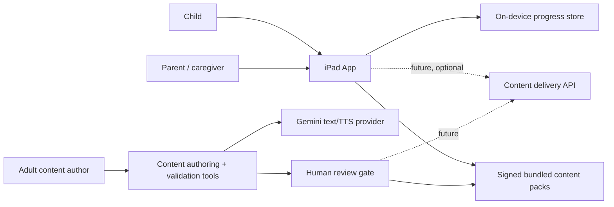
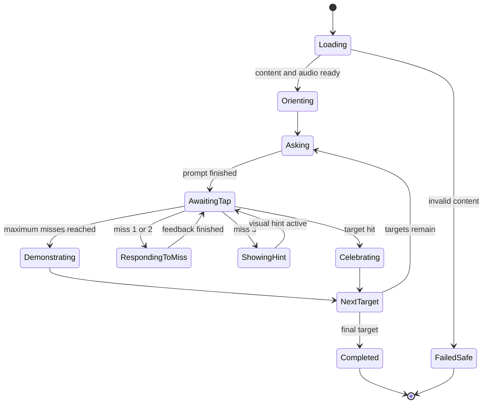

# Software Architecture

## 1. Architectural stance

Build a native, modular iPad application in SwiftUI. The critical child experience
is local-first and deterministic. Generative AI is an authoring dependency behind
an interface, not the authority for game rules, hit-testing, progress metrics, or
unreviewed child-facing speech.

Recommended baseline:

- Latest stable Xcode available to the implementer.
- Swift 6 language mode where supported by the selected Xcode version.
- Minimum deployment target: iPadOS 17, subject to a device-support decision before
  implementation begins.
- SwiftUI for UI and navigation.
- SwiftData for local event persistence and migrations.
- AVFoundation for reviewed audio playback; `AVSpeechSynthesizer` only as fallback.
- Swift Package Manager only when an external dependency has a demonstrated need.
- XCTest and XCUITest for automated verification.

## 2. System context



The iPad application does not possess a Gemini credential. Only the developer-side
authoring tool or a future server proxy can call Gemini.

## 3. Module boundaries

```text
HiddenObjectLearning/
  App/
    AppEntry
    AppRouter
    DependencyContainer
    AppConfiguration
  AppShell/
    ChildHome
    ParentGate
    ParentDashboard
    Settings
  Features/
    HiddenObjects/
      Domain/
      Gameplay/
      Presentation/
      Metrics/
      Tests/
  Core/
    Content/
    Audio/
    Persistence/
    LearningEvents/
    DesignSystem/
    Accessibility/
    Security/
    Utilities/
  Resources/
    ContentPacks/
    Audio/
    Assets/
  Tests/
    Integration/
    UI/
content-tools/                 # separate developer-only executable/package
  importers/
  annotator/
  validators/
  gemini-provider/
  packager/
docs/
```

The exact Xcode group layout may differ, but the dependency direction must remain:

```text
App -> AppShell -> Feature -> Core protocols/domain
                          -> Core implementations injected by App
content-tools -> content schemas/provider interfaces; never imported by the iPad target
```

Feature code may depend on shared protocols, but Core must not import a feature.

## 4. Core protocols

The implementer should define small protocols before concrete types. Names may be
adjusted, but responsibilities must stay separate.

```swift
protocol ActivityModule {
    var descriptor: ActivityDescriptor { get }
    func makeEntryView(context: ActivityContext) -> AnyView
}

protocol SceneCatalog {
    func availableScenes(for activityID: ActivityID) async throws -> [Scene]
    func contentPackVersion() async -> String
}

protocol AudioGuidance {
    func play(_ cue: AudioCue) async throws
    func stop()
}

protocol ProgressRepository {
    func append(_ event: LearningEvent) async throws
    func sessions(in interval: DateInterval) async throws -> [LearningSession]
    func resetAll() async throws
}

protocol TargetSelecting {
    func select(from candidates: [Target], limit: Int, history: TargetHistory) -> [Target]
}

protocol ParentMetricsCalculating {
    func summary(from events: [LearningEvent], interval: DateInterval) -> ParentSummary
}
```

Do not expose Gemini-specific request or response types outside the developer-only
provider adapter.

## 5. Hidden-object domain model

### Immutable content

- `ContentPack`: id, schema version, content version, locale, checksum, scenes.
- `Scene`: id, title, image asset, native pixel size, candidate targets, rules.
- `Target`: stable id, canonical English label, prompt audio, feedback audio, hit
  geometry, difficulty, optional semantic tags.
- `HitGeometry`: normalized bounding rectangle plus optional polygon.
- `AudioAsset`: stable id, relative URL/path, duration, checksum, transcript, locale.
- `RightsRecord`: provenance, license, attribution, source URL, approval status.

### Mutable session state

- `HiddenObjectSession`: session id, scene id, selected target ids, current index,
  state, timing, content version.
- `TargetRound`: target id, miss count, hint level, start time, completion mode.
- `GameplayState`: `loading`, `orienting`, `asking`, `awaitingTap`, `respondingToMiss`,
  `showingHint`, `celebrating`, `demonstrating`, `completed`, `paused`, `failedSafe`.

The gameplay reducer/state machine is the single authority. Views render state and
send user intents; they do not mutate the round directly.

## 6. Gameplay state machine



Required state-machine rules:

- One counted scene tap is processed at a time.
- Only `awaitingTap` accepts attempts.
- A replay-audio request does not change the miss count.
- Hint state begins at exactly three misses unless a tested configuration overrides
  it for QA.
- Completion mode is one of `independent`, `assisted`, or `demonstrated`.
- Backgrounding pauses active-time measurement and audio.
- Restoration either resumes the current round safely or restarts that scene; it
  never fabricates a completion.

## 7. Coordinate and hit-test system

Persist normalized image-space coordinates so content is independent of device
resolution:

```json
{
  "bbox": { "x": 0.418, "y": 0.332, "width": 0.074, "height": 0.102 },
  "polygon": [[0.43, 0.34], [0.47, 0.33], [0.49, 0.41], [0.44, 0.43]],
  "touchExpansion": 0.012
}
```

All values are in `[0, 1]`, measured from the top-left of the uncropped source image.

At runtime:

1. Compute the exact rectangle in which the source image is aspect-fitted.
2. Reject taps outside that rectangle.
3. Convert the point to normalized source-image coordinates.
4. Test the polygon when present; otherwise test the rectangle.
5. Apply `touchExpansion` only after validation confirms it cannot overlap another
   plausible object.
6. Record only hit/miss and target id for progress; raw tap coordinates are not
   required for the parent log.

Cropping a scene after annotation invalidates coordinates and must force a new
content version.

## 8. Target selection

Each scene contains exactly ten launch-quality annotated candidates. A session asks
for at most five. The selector should be deterministic given its seed so tests can
reproduce choices.

Suggested weighted policy:

- Exclude candidates used in the immediately preceding play of the same scene when
  enough alternatives exist.
- Prefer a mix of easy, medium, and harder visual locations.
- Slightly increase weight for targets with low recent independent success.
- Do not choose two objects whose accepted touch regions materially overlap.
- Do not choose more than one ambiguous label or visually tiny object in a session.
- Keep selection logic local and explainable; Gemini is not involved.

Persist the selected ids at session start so resume and metrics remain consistent.

## 9. Learning event model

Use append-only events as the source for parent summaries. Suggested event fields:

```text
id                  UUID
schemaVersion       Int
occurredAt          Date
sessionID           UUID
activityID          String
sceneID             String
targetID            String?
eventType           sessionStarted | promptPlayed | attempt | hintShown |
                    targetCompleted | targetDemonstrated | sessionEnded
attemptNumber       Int?
outcome             hit | miss | independent | assisted | demonstrated | abandoned
activeDurationMs    Int?
contentVersion      String
```

No name, email, advertising identifier, device fingerprint, location, audio, photo,
or free-form child text belongs in an event.

Parent summaries are derived views, not separately authoritative data. This keeps
metric definitions testable and permits future recomputation.

## 10. Persistence

Use two stores:

1. **Read-only content store:** bundled versioned JSON manifest plus images/audio.
2. **Writable progress store:** SwiftData models for sessions/events/settings.

Rules:

- Never write into the app bundle.
- Migrate event schemas additively where possible.
- Store the content version on each session and event.
- Use file protection appropriate for local app data.
- Provide an atomic “Reset Progress” operation behind parental confirmation.
- Avoid iCloud entitlements in version 1.
- Unit-test metric calculations using in-memory persistence.

## 11. Audio subsystem

`AudioGuidanceService` owns one narration channel and a limited effects channel.

- Narration has priority over nonessential effects.
- Replaying stops and restarts the current instruction cleanly.
- Advancing cancels stale queued narration.
- Audio interruption and app backgrounding pause safely.
- Maintain a transcript for every clip for accessibility, review, and fallback TTS.
- Validate duration and silence so a malformed clip cannot stall the state machine.
- Use checksums to detect corrupt downloaded assets in a future content update.

Do not infer “female” from a model voice name. The product owner should audition
several voices and approve the final presentation. Current Gemini TTS options include
voice styles described as gentle, warm, soft, and friendly; use those only as audition
candidates.

## 12. Gemini boundary

As verified on 2026-07-29, Google lists `gemini-3.6-flash` with free-tier access and
lists preview Gemini TTS models. Exact model availability and quotas can change, so
model ids are configuration, never domain constants.

Recommended authoring configuration:

```text
GEMINI_TEXT_MODEL=gemini-3.6-flash
GEMINI_TTS_MODEL=gemini-2.5-flash-preview-tts
GEMINI_API_KEY=<loaded from developer environment only>
```

Use Gemini for:

- Drafting short English prompt/feedback variants from strict templates.
- Generating candidate narration clips at content-build time.
- Optional content QA suggestions that a human reviewer must accept.

Do not use Gemini for:

- Determining whether a tap is correct.
- Selecting an unreviewed phrase for a child.
- Receiving child voice, images, identifiers, or behavioral event history.
- Runtime operation that would make offline play fail.

Developer secret handling:

- The existing `gem_api.txt` is outside this project and may be read only by a local
  developer tool when explicitly invoked.
- Prefer setting `GEMINI_API_KEY` in the process environment.
- Add secret filename patterns to source-control ignores when a repository is
  initialized.
- Production calls, if ever needed, go through a server proxy with Secret Manager,
  rate limits, allowlisted prompts, logging redaction, and cost alerts.
- Never hardcode, copy, print, log, or bundle the key.

Google explicitly warns against embedding Gemini keys in mobile clients. The free
tier may use submitted content to improve products; version 1 sends only static,
adult-authored content—not child data.

## 13. Parent metrics architecture

The dashboard reads from a `ParentMetricsCalculating` service. Calculations must be
pure functions over events and covered by fixtures for:

- no data;
- abandoned targets;
- correct first try;
- correct after one/two misses;
- correct after a visual hint;
- demonstrated target;
- interrupted/resumed session;
- events from an older content version;
- date-boundary and timezone handling.

Use plain-language labels and an information button explaining every metric. Never
surface a medical interpretation.

## 14. Accessibility and reliability

- Support VoiceOver labels for chrome, while keeping the game instruction audio
  independent.
- Support Dynamic Type in parent views.
- Do not rely on color alone.
- Respect Reduce Motion and system volume/mute behavior.
- Test with Guided Access.
- Avoid tiny targets; annotation validation enforces a minimum rendered size.
- Handle missing/corrupt content by skipping that scene and showing a calm home
  fallback, not a developer error.
- Instrument locally with OSLog but exclude content of child events and secrets.

## 15. Security and child privacy

Version 1 is deliberately data-minimal:

- no microphone permission;
- no accounts or remote identifiers;
- no third-party analytics or advertising SDKs;
- no network required for play;
- no links outside the app without a parental gate;
- progress stays on device;
- privacy policy describes local storage and any content download behavior;
- deletion is available to the parent.

Apple's Kids Category guidance requires particular care with third-party data
collection and parental gates. COPPA treats a child's voice recording as personal
information. The proposed no-microphone design avoids that collection entirely.
Formal legal review is still required before App Store submission.

## 16. Future evolution

Possible later additions without changing the version-1 contracts:

- New activity modules registered with `ActivityModule`.
- New locales with localized manifests and matching reviewed audio packs.
- Signed content-pack download service.
- Parent-approved cloud backup.
- Alternative access modes.
- A speech-based activity, only after a separate privacy architecture, consent flow,
  data-retention policy, and legal review.

Avoid a generic “god service,” global mutable session state, feature-to-feature
imports, or an LLM provider embedded in UI code.

## 17. Authoritative references

- [Google Gemini API pricing and current model availability](https://ai.google.dev/gemini-api/docs/pricing)
- [Google Gemini TTS documentation](https://ai.google.dev/gemini-api/docs/speech-generation)
- [Google API key security guidance](https://ai.google.dev/gemini-api/docs/api-key)
- [Apple AVSpeechSynthesizer documentation](https://developer.apple.com/documentation/avfaudio/avspeechsynthesizer)
- [Apple App Review Guidelines](https://developer.apple.com/app-store/review/guidelines/)
- [Apple guidance for kids apps](https://developer.apple.com/kids/)
- [FTC COPPA compliance FAQ](https://www.ftc.gov/business-guidance/resources/complying-coppa-frequently-asked-questions)
