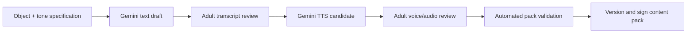

# Content and Annotation Pipeline

## 1. Launch content target

The initial pack contains:

- 10 original or properly licensed landscape scenes.
- Exactly 10 annotated candidate objects per scene (100 candidates total).
- At most 5 requested objects in any single play of a scene.
- Reviewed English prompt and feedback audio for every object.
- Rights/provenance records and coordinate validation for every scene.

“Google Images” is a search interface, not a content license. Do not scrape random
results into the app. Search may be used to discover source collections, but every
selected asset must have explicit commercial redistribution rights or be replaced
with commissioned/original/generated art. Preserve proof of license.

## 2. Recommended launch-scene strategy

For consistent quality and unambiguous coordinates, commission or generate ten
original scenes to a common art bible, then have a human illustrator/content editor
correct them. Example themes:

1. Enchanted garden picnic.
2. Cozy playroom.
3. Friendly farm morning.
4. Seaside sandcastle day.
5. Woodland campsite.
6. Colorful kitchen baking scene.
7. Gentle dinosaur museum.
8. Snowy park.
9. Underwater reef adventure.
10. Neighborhood market.

These are planning themes, not final assets. Each scene should include at least ten
clear, nameable objects familiar to an English-speaking preschooler. Avoid cultural
stereotypes, weapons, frightening imagery, brand characters, illegible tiny objects,
and deceptive occlusion.

## 3. Art bible

- Landscape 4:3 master, recommended 2732×2048 or larger.
- Premium 2D children's-storybook look with rounded shapes and soft outlines.
- Rich detail organized into visual zones; not a “Where’s Waldo” difficulty level.
- Warm natural palette with accessible local contrast around target shapes.
- No embedded words, logos, watermarks, UI, or copyrighted characters.
- Objects must have stable silhouettes and preschool-familiar canonical names.
- At least three easy, four medium, and three harder candidates per scene.
- Targets cannot depend solely on a subtle shade distinction.
- Important content remains inside safe margins for minor aspect-ratio variations.

## 4. Rights record

Every scene needs a record like:

```json
{
  "assetID": "scene.garden-picnic.v1",
  "creator": "Creator or generation workflow identifier",
  "sourceURL": null,
  "license": "owned-original",
  "commercialUse": true,
  "redistribution": true,
  "attributionRequired": false,
  "acquiredAt": "2026-07-29T00:00:00Z",
  "proofPath": "rights/scene.garden-picnic.v1.pdf",
  "reviewedBy": "adult-reviewer-id",
  "reviewStatus": "approved"
}
```

Reject any asset whose rights are unknown, whose license prohibits app bundling or
derivatives, or whose attribution cannot be satisfied inside a parent-gated credits
screen.

## 5. Annotation workflow

An internal annotation tool should provide:

1. Import scene and record native dimensions and SHA-256 hash.
2. Draw a bounding rectangle around one semantic object.
3. Optionally refine with a polygon for irregular or adjacent shapes.
4. Enter canonical label, child-friendly prompt, difficulty, and semantic tags.
5. Preview at each supported iPad layout.
6. Simulate touch expansion and flag overlap with other targets/distractors.
7. Attach reviewed audio assets and transcripts.
8. Validate ten candidates and five-target session combinations.
9. Export a versioned manifest.
10. Require a second human approval before packaging.

Coordinates are normalized to source-image dimensions and originate at the top-left.
Never annotate against a resized screenshot.

## 6. Manifest example

```json
{
  "schemaVersion": 1,
  "contentVersion": "2026.1.0",
  "locale": "en-US",
  "activity": "hidden-objects",
  "defaults": {
    "targetsPerSession": 5,
    "visualHintAfterMisses": 3,
    "demonstrateAfterMisses": 5
  },
  "scenes": [
    {
      "id": "garden-picnic",
      "image": {
        "path": "images/garden-picnic.webp",
        "pixelWidth": 2732,
        "pixelHeight": 2048,
        "sha256": "REQUIRED_AT_BUILD_TIME"
      },
      "rightsRecord": "rights/garden-picnic.json",
      "targets": [
        {
          "id": "garden-picnic.bunny",
          "label": "bunny",
          "difficulty": "easy",
          "prompt": {
            "text": "Can you find the bunny?",
            "audioID": "prompt.bunny.01"
          },
          "success": {
            "text": "You found the bunny!",
            "audioID": "success.bunny.01"
          },
          "hint": {
            "text": "The bunny is right here.",
            "audioID": "hint.bunny.01"
          },
          "geometry": {
            "bbox": { "x": 0.418, "y": 0.332, "width": 0.074, "height": 0.102 },
            "touchExpansion": 0.012
          },
          "tags": ["animal", "white"]
        }
      ]
    }
  ],
  "audio": [
    {
      "id": "prompt.bunny.01",
      "path": "audio/en-US/prompt-bunny-01.m4a",
      "transcript": "Can you find the bunny?",
      "durationMs": 1840,
      "sha256": "REQUIRED_AT_BUILD_TIME",
      "reviewStatus": "approved"
    }
  ]
}
```

The example contains one target for readability; production validation requires ten
per scene.

## 7. Automated validation

Fail the content build if any condition is violated:

- schema or content version missing;
- locale not `en-US` for the version-1 pack;
- scene count not 10 for the launch pack;
- candidate count not 10 per launch scene;
- session limit outside 1–5;
- duplicate stable ids;
- missing image/audio/rights files;
- checksum mismatch;
- source pixel dimensions do not match manifest;
- coordinate or polygon point outside `[0, 1]`;
- zero/negative geometry;
- accepted touch region too small on the smallest supported iPad;
- unsafe hit-region overlap;
- missing transcript or transcript/audio mismatch;
- missing human approval;
- unsupported/unknown license;
- object label absent from the scene or ambiguous during review.

## 8. Manual validation checklist

For each scene, two adults independently verify:

- Every target exists and has only one clearly intended instance.
- A preschooler can name the object from the selected label.
- The hit region accepts the visible object and does not accept nearby distractors.
- The visual hint points to the correct object without covering it.
- Every spoken line says the exact approved transcript.
- Voice tone is caring, natural, and consistent.
- Scene is comfortable at normal iPad viewing distance.
- No accidental text, logo, watermark, scary element, unsafe situation, or sensitive
  stereotype appears.
- The scene remains functional in Reduce Motion and with prompt text disabled.

Then run a small supervised usability test with parents' permission. Record only
de-identified observations needed to improve content; do not record children in the
production app.

## 9. Gemini-assisted authoring

Gemini may draft transcript variants and voice candidates. A developer-side command
reads the credential from the environment, sends only static adult-authored text,
and writes unapproved output to an isolated staging folder.

Pipeline:



Suggested TTS audition prompt:

```text
Synthesize only the transcript below.
Adult feminine-presenting English learning guide for a child aged 3–5.
Warm, gentle, patient, reassuring, natural vocal smile, clear articulation,
slightly slower than ordinary conversation. Never babyish or exaggerated.

TRANSCRIPT:
Can you find the bunny?
```

Audition several voices; do not assume a voice's marketing descriptor determines
gender presentation. Store the selected voice/model/prompt as build provenance, but
the iPad runtime depends only on the approved audio file.

## 10. Content versioning

- `schemaVersion` changes only for structural schema changes.
- `contentVersion` uses semantic versioning.
- Coordinate/art/audio changes require at least a patch version.
- Stable scene and target ids survive art revisions when semantic identity remains.
- A pack is immutable after release.
- Parent events retain the content version used during play.
- Future downloaded packs require a signature, checksum, minimum-app-version field,
  atomic install, and rollback to the last known-good pack.
